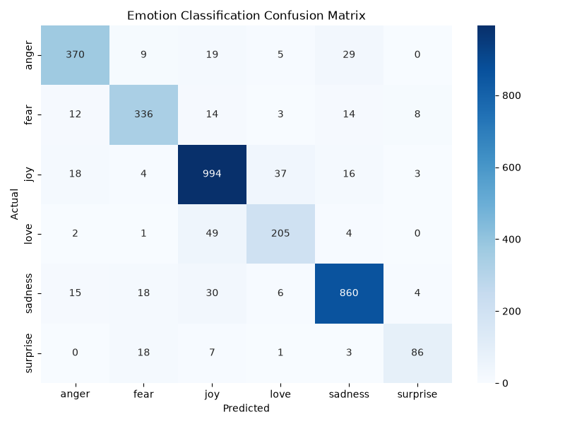

# 😊 End-to-End NLP Emotion Classification System

## 🚀 Overview

An end-to-end Natural Language Processing (NLP) application that detects human emotions from text using Machine Learning.

The system classifies user text into one of six emotions:

* 😄 Joy
* 😢 Sadness
* 😡 Anger
* 😨 Fear
* ❤️ Love
* 😲 Surprise

The project includes:

* Data preprocessing pipeline
* TF-IDF feature engineering
* Multiple model evaluation
* Linear SVC classifier
* Streamlit web application
* Model persistence using Joblib
* Confusion matrix visualization

---

## 🖥️ Application UI

### 🖥️ Streamlit UI - Home Screen


---

## 🎯 Problem Statement

Understanding human emotions from text is an important NLP task used in:

* Customer feedback analysis
* Chatbots and virtual assistants
* Mental health monitoring
* Social media sentiment tracking
* Recommendation systems

This project aims to build an efficient and lightweight emotion classification system using classical Machine Learning techniques.

---

## 🏗️ Project Architecture

```text
User Input
    ↓
Text Preprocessing
    ↓
TF-IDF Vectorization
    ↓
Linear SVC Model
    ↓
Emotion Prediction
    ↓
Streamlit UI
```

---

## 📂 Project Structure

```text
emotion-detection/
│
├── app/
│   └── streamlit_app.py
│
├── data/
│   └── train.txt
│
├── models/
│   ├── emotion_model.pkl
│   └── tfidf_vectorizer.pkl
│
├── outputs/
│   └── confusion_matrix.png
│
├── src/
│   ├── preprocess.py
│   ├── train.py
│   └── predict.py
│
├── requirements.txt
└── README.md
```

---

## 📊 Dataset Information

### Dataset Size

* Total Samples: 16,000
* Emotion Classes: 6

### Emotion Distribution

| Emotion  | Samples |
| -------- | ------: |
| Joy      |    5362 |
| Sadness  |    4666 |
| Anger    |    2159 |
| Fear     |    1937 |
| Love     |    1304 |
| Surprise |     572 |

---

## ⚙️ Data Preprocessing

The following preprocessing steps are applied:

* Convert text to lowercase
* Remove special characters
* Remove punctuation
* Remove stopwords
* Tokenization using NLTK

Example:

Input:

```text
I am feeling very happy today!!!
```

Processed:

```text
feeling happy today
```

---

## 🔬 Feature Engineering

TF-IDF (Term Frequency–Inverse Document Frequency) is used to convert text into numerical feature vectors.

Configuration:

* Maximum Features: 5000
* Sparse Matrix Representation
* Train/Test Split: 80/20
* Stratified Sampling

---

## 🤖 Model Evaluation

Two models were evaluated.

| Model               | Accuracy |
| ------------------- | -------: |
| Logistic Regression |   86.59% |
| Linear SVC          |   88.81% |

### 🏆 Best Model

**Linear SVC**

Final Accuracy:

```text
88.81%
```

---

## 📈 Classification Performance

| Emotion  | Precision | Recall | F1 Score |
| -------- | --------- | ------ | -------- |
| Anger    | 0.89      | 0.86   | 0.87     |
| Fear     | 0.87      | 0.86   | 0.87     |
| Joy      | 0.89      | 0.93   | 0.91     |
| Love     | 0.79      | 0.77   | 0.78     |
| Sadness  | 0.93      | 0.92   | 0.92     |
| Surprise | 0.84      | 0.76   | 0.79     |

---

## 📉 Confusion Matrix



---

## 🖥️ Application UI

Add Streamlit screenshots here.

### Home Screen

```markdown

```

### Prediction Result

```markdown

```

---

## 💡 Sample Predictions

### Example 1

Input:

```text
I am feeling very happy today
```

Prediction:

```text
😄 Joy
```

---

### Example 2

Input:

```text
I am extremely nervous about tomorrow
```

Prediction:

```text
😨 Fear
```

---

### Example 3

Input:

```text
I miss my old friends and feel lonely
```

Prediction:

```text
😢 Sadness
```

---

## 🛠️ Installation

### Clone Repository

```bash
git clone <repository-url>
cd emotion-detection
```

### Install Dependencies

```bash
pip install -r requirements.txt
```

---

## 🚀 Training

```bash
python src/train.py
```

This will:

* Train models
* Compare performance
* Save best model
* Generate confusion matrix

---

## 🔮 Inference

```bash
python src/predict.py
```

Example Output:

```python
{
    "input_text": "I am feeling very happy today",
    "processed_text": "feeling happy today",
    "predicted_emotion": "joy",
    "model": "Linear SVC"
}
```

---

## 🌐 Run Web Application

```bash
streamlit run app/streamlit_app.py
```

---

## 📌 Technologies Used

* Python
* Scikit-Learn
* NLTK
* Pandas
* Joblib
* Streamlit
* Matplotlib
* Seaborn

---

## 👨‍💻 Author

Shubham Sinha | AI Engineer

---

## ⭐ If you found this project useful, consider giving it a star.
